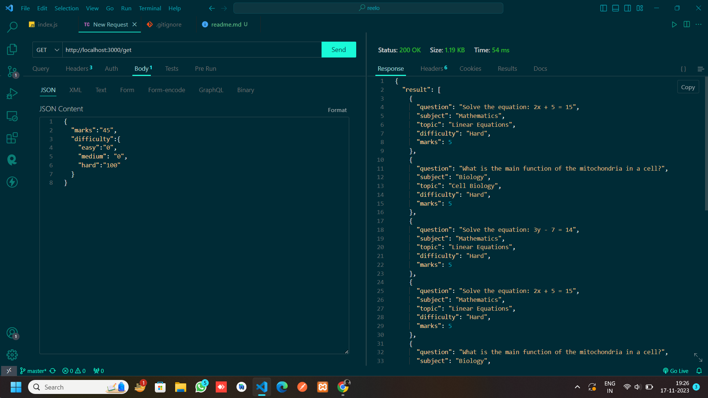

#### Download the zip file and extract in your computer
#### Open the extracted folder in an editor eg: VS code
#### Open terminal and then;
#### Run npm i to install all the dependencies
#### Run the command "nodemon ./index.js" in the terminal
#### Open postman and send a GET request along with the required parameters.
EG: 